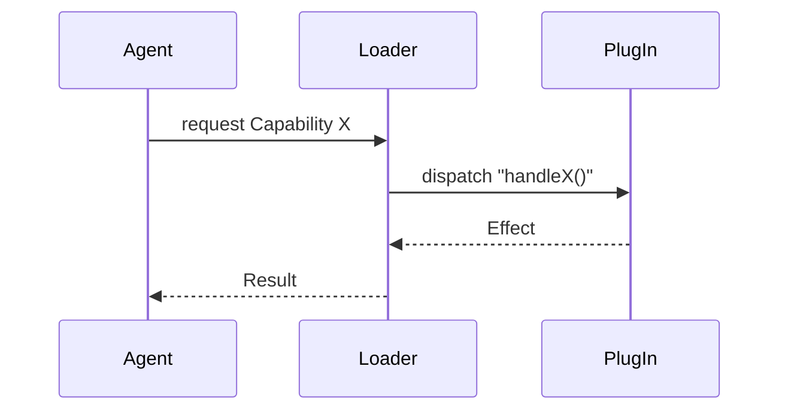

# LLM Project Instructions

## Creating & Maintaining **Domain‑Driven** Documentation

> **Audience** — Automated agents (and humans) contributing to Stonekin’s docs.
> **Goal** — Ship `_DOMAIN.md` files that start from the **problem space**, speak the **ubiquitous language**, and stay valuable long after the code has changed—whether the domain is market analysis *or* runtime plug‑ins.

---

### 1 – Why We Need This

Stonekin follows **Domain‑Driven Documentation (DDD)**: every enduring concept—tax rules, cybernetic theory, functional programming idioms—earns a co‑located `_DOMAIN.md` next to the code it explains. These files:

* Act as *human‑readable schemas* for future maintainers.
* Provide a shared vocabulary for code, tests, and ADRs.
* Serve as canonical links in design reviews and PRs.

Some domains *are the program itself* (build pipelines, agent orchestration). That “strange loop” is fine—describe the **problem** first (what the user/agent needs), then follow with implementation notes.

#### A Note on Technical Domains

When documenting technical domains (build systems, agent frameworks, language tooling), embrace the natural convergence: your domain language IS your technical language. A build pipeline's ubiquitous language includes terms like "artifacts," "dependencies," and "stages" - these aren't mere implementation details but core domain concepts. 

This creates a powerful alignment where:
- Science domains naturally use scientific terminology
- Mathematical domains embrace mathematical language  
- Functional programming domains employ functional idioms
- Agent system domains speak in terms of capabilities and perceptions

The "strange loop" where domain documentation describes the system that processes domain documentation is a feature, not a bug.

---

### 2 – When to Touch a Domain File

| Situation                                 | Action                         |
| ----------------------------------------- | ------------------------------ |
| New concept reaches consensus             | `create <module>/_DOMAIN.md`   |
| Missing / outdated definition or example  | `amend` the relevant section   |
| Implementation change breaks an invariant | `clarify` via *Revision Note*  |
| Whole file no longer relevant             | Set `status: deprecated` & why |

> **Reviewer lens:** If you’d ask “Where’s the doc for that term?”, it probably belongs in (or near) a domain file.

---

### 3 – File Anatomy

Each domain file begins with **YAML front‑matter**:

```yaml
---
title: Functional Effects DSL
authors: ["Audrey Jensen", "Daemon AI"]
revision: 2025‑07‑11
status: draft            # draft | review | stable | deprecated
tags: ["domain", "fp", "runtime"]
adr_links: [0008, 0012]
---
```

#### Required Sections *(order may vary)*

1. **Purpose** — one paragraph: *why this domain exists*. For technical domains, this may describe both the problem space and the system addressing it.
2. **Ubiquitous Language** — glossary (`Term | Meaning`).
3. **Key Principles / Invariants** — bullet list of truths that **must** hold.
4. **Conceptual Model** — mermaid diagram *or* ASCII sketch.
5. **Relationships & Anti‑patterns** — clarify boundaries; cite ADRs.
6. **Revision History** — appended by tooling (see §7).

#### Optional Sections

* **Worked Examples** — minimal runnable snippets (TS, Rust, Bash, etc.).
* **Open Questions** — design issues yet to be resolved.
* **External References** — RFCs, papers, blog posts.

---

### 4 – Writing Rules & Style Guide

| Rule                              | Why it matters / Tips                                                                                                 |
| --------------------------------- | --------------------------------------------------------------------------------------------------------------------- |
| **Lead with the problem space**   | Describe *Capabilities, Value Objects, Aggregates* (≈ interfaces, immutable types, mixin‑roots) **before** DB tables. |
| **Active voice**                  | “The Scheduler *invokes* each hook,” not “Hooks are invoked…”.                                                        |
| **One concept ≈ one heading**     | Easier linking; easier diffs. Aim ‹ 100‑word paragraphs.                                                              |
| **Show, don’t tell**              | Code > prose. Fence runnable snippets with language tags.                                                             |
| **Keep diagrams current**         | Update mermaid **and** ASCII art together.                                                                            |
| **Reference ADRs, don’t replace** | If advice conflicts, add a footnote and propose a new ADR.                                                            |
| **Cite commits**                  | Use short Git SHAs (e.g., `2a4e9fa`) to anchor changes.                                                               |
| **Inclusive language**            | Prefer neutral terms (e.g., allow‑list / deny‑list).                                                                  |
| **Write in present tense**        | Domain docs describe *what is*, so use present tense rather than future speculation.                                  |

---

### 5 – Minimal Example Snippets

#### Mermaid (sequence)



#### TypeScript

```ts
import { CapabilityX } from "@stonekin/runtime";

export const handler: CapabilityX = async (input) => {
  return { status: "ok", echo: input }; // Pure example
};
```

---

### 6 – Edit & Review Workflow

1. Draft change → run `markdownlint` & link checker.
2. Commit & PR → title `docs(domain): <verb> <topic> (#issue)`; include rendered diff.
3. PR body → explain *why* + screenshot if diagrams changed.
4. Human review → at least one maintainer for the domain.
5. Merge → CI bumps `revision` and appends history.

---

### 7 – Revision History Format

Append entries only:

```revision-history
2025‑07‑11  Audrey Jensen  ✓ Initial file via LLM‑agent (#123)
2025‑07‑13  Daemon AI      ✎ Added worked examples
```

*Tooling parses this block; never rewrite existing lines.*

---

### 8 – Common Pitfalls & Fixes

| Pitfall                  | Remedy                                                                |
| ------------------------ | --------------------------------------------------------------------- |
| **Shadow terms**         | Disambiguate in the glossary (e.g., *Event* vs *Signal*).             |
| **Implementation creep** | UI IDs or temp URLs → move to code comments unless they’re contracts. |
| **Missing refs**         | Link specs (e.g., **RFC 9457**), white‑papers, vendor docs.           |
| **Diagram drift**        | Run `npm run docs:test`; CI fails on orphan diagrams.                 |
| **Mega‑docs**            | Split docs > 600 lines; add “See also” links.                         |

---

### 9 – Agent Latitude / No‑Fly List

**Allowed**

* Re‑order sections for clarity.
* Add diagrams, tables, or external links.
* Modernise terminology (black‑list → deny‑list).
* Split / merge files when concepts evolve.

**Forbidden**

* Break `mkdocs build --strict`.
* Delete, alter, or reorder *revision‑history* lines.
* Edit accepted ADRs directly (propose a new ADR instead).

---

### 10 – Glossary

| Term                    | Meaning                                                          |
| ----------------------- | ---------------------------------------------------------------- |
| **ADR**                 | Architecture Decision Record (immutable after acceptance).       |
| **Domain File**         | `_DOMAIN.md` located with its corresponding code module.         |
| **Ubiquitous Language** | Shared vocabulary bridging code and prose.                       |
| **Capability**          | High‑level behaviour provided by the domain.                     |
| **Value Object**        | Small immutable type defined solely by its data.                 |
| **Aggregate**           | Consistency boundary, usually backed by a root literal or class. |
| **LLM‑Agent**           | Automated contributor following these instructions.              |

---

*Last updated: 2025‑07‑11 by Daemon AI – Polished for clarity and consistency*
