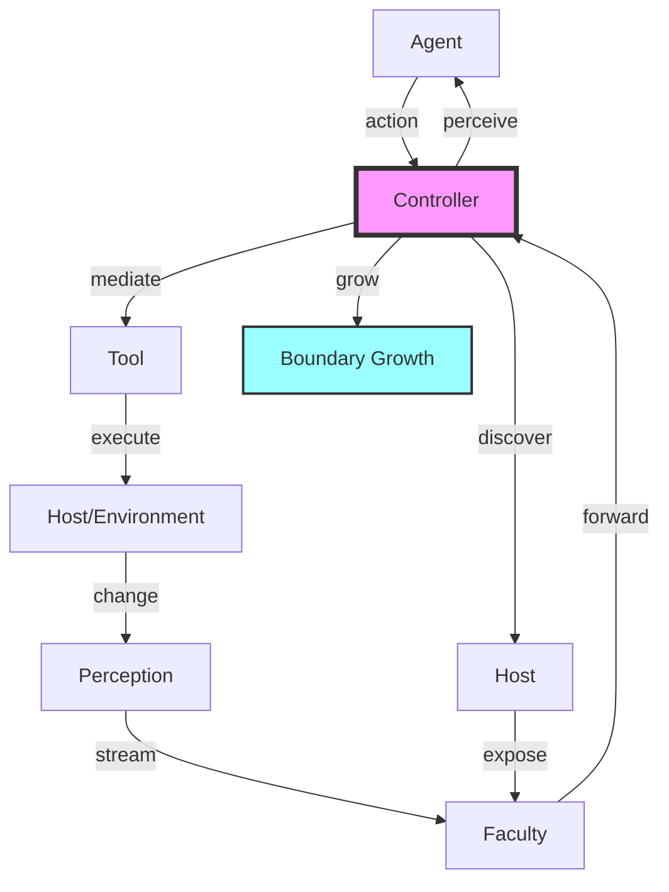

# Core Domain

## Overview

The core domain regulates the fundamental feedback loop between agents and their environment, defining the computational boundary that creates agency itself. This domain establishes what is "inside" an agent versus what is "outside," providing the root systems required by every Stonekin instance. The boundary - maintained by the Controller - is not merely an interface but the living negotiation that enables agents to perceive, act, and grow within their environment while maintaining autonomy.

## Core Concepts

### Entities

- **Agent**: An entity capable of making decisions within its boundary. Agents form a hierarchy based on authority levels:
  - **FreeAgent**: Possesses final termination authority and can delegate its freedom
  - **SubordinateAgent**: Operates with authority delegated from a FreeAgent
  - **SystemAgent**: Pure functional agents with no autonomy, handling resilience, telemetry, and recovery

- **Controller**: The boundary itself - mediates all interaction between agent and environment. Maintains the subscription topology that defines what an agent can perceive and how it can act. The controller forwards perceptions from faculties to agents and executes agent actions through tools.

- **Host**: Represents the agent's environment and substrate. Provides uptime/downtime notifications and maintains the registry of available faculties. The host enables growth by exposing new capabilities.

- **Faculty**: A hierarchical grouping of tools and perceptions that extend the host. Faculties reduce complexity by organizing related capabilities, creating the structure: Host → Faculty → Tools & Perceptions.

- **Tool**: An action an agent can take in its environment. Tools are provided by faculties and extend the agent's ability to affect change.

### Processes

The domain operates through two interconnected feedback loops:

**Primary Loop (Action-Perception)**:

- Agent decides action → Controller mediates → Tool executes → Environment changes → Faculty perceives → Controller forwards → Agent observes
- Maintains agent function but consumes computational resources

**Secondary Loop (Capability Discovery)**:

- Host exposes faculties → Controller discovers → Agent grows boundary → New tools/perceptions available
- Enables boundary expansion and represents actual growth

## Technical Model

### Type Definitions

```typescript
// Agent hierarchy with authority model
export type Agent = FreeAgent | SubordinateAgent | SystemAgent;

export type Authority = {
  readonly canTerminate: boolean;
  readonly canDelegate: boolean;
  readonly scope: readonly string[];
};

// Boundary maintenance
export type Controller = {
  readonly agentId: AgentId;
  readonly boundary: BoundaryState;
  forward(perception: Perception): void;
  execute(action: Action): Result<void, BoundaryError>;
  discover(): Observable<Faculty>;
};

// Environmental substrate
export type Host = {
  readonly faculties: ReadonlyMap<FacultyId, Faculty>;
  readonly status: Observable<HostStatus>;
  register(faculty: Faculty): Result<void, RegistrationError>;
};

export type Faculty = {
  readonly id: FacultyId;
  readonly tools: ReadonlyMap<ToolId, Tool>;
  readonly perceptions: PerceptionStream;
};
```

### Key Operations

```typescript
// Maintain the living boundary between agent and environment
export function maintainBoundary(
  controller: Controller,
  host: Host
): Observable<BoundaryState> {
  // Merges perception streams with action executions
  // Ensures boundary integrity through backpressure
}

// Enable growth through capability discovery
export function enableGrowth(
  host: Host,
  controller: Controller
): Observable<GrowthEvent> {
  // Secondary feedback loop for boundary expansion
}

// Transfer freedom for hot upgrades
export function delegateAuthority(
  from: FreeAgent,
  to: Agent,
  scope: AuthorityScope
): Result<void, DelegationError> {
  // Enables agents to transcend current form
}
```

## System Integration



## Invariants & Constraints

- **Boundary Integrity**: Every perception must flow through the Controller - no direct agent-environment coupling
- **Authority Hierarchy**: SystemAgents cannot gain autonomy; FreeAgents cannot be created without delegation
- **Subscription Coherence**: To perceive is to subscribe - observation changes the system
- **Growth Monotonicity**: Boundaries can expand but faculty removal requires explicit authority

## Evolution Notes

**Current State**: Defines the conceptual boundary and authority model. Provides interfaces for host integration and faculty registration.

**Growth Vectors**:

- Self-reflection systems monitoring the Controller itself
- Multi-agent boundary negotiation protocols  
- Authority delegation chains for complex hierarchies
- Faculty composition and inheritance patterns

**Design Philosophy**: The boundary is not a wall but a living process. Growth requires energy investment. Authority enables transformation. System agents ensure resilience without compromising autonomy.
